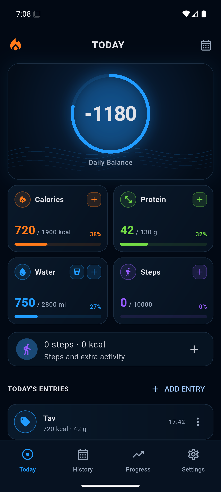
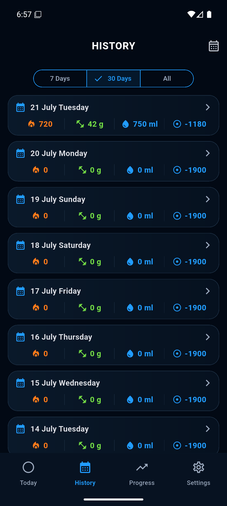
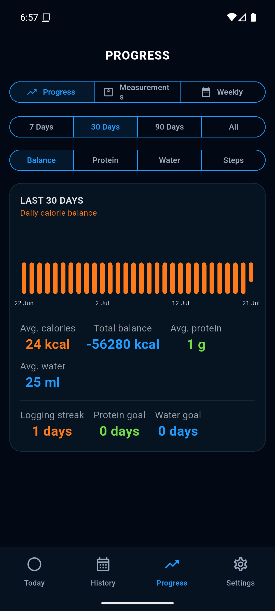
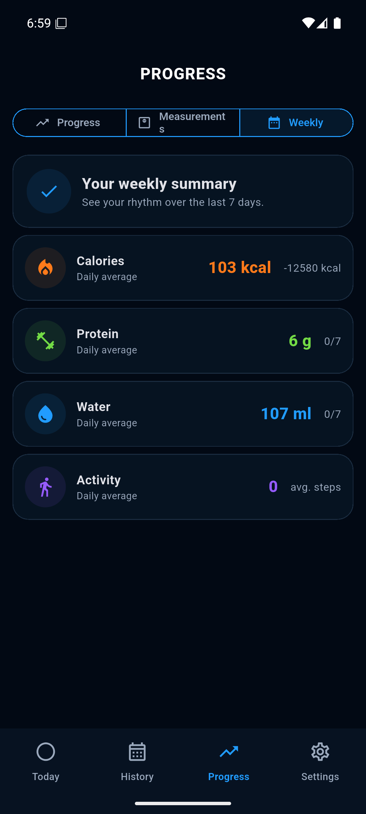

<p align="center">
  
</p>

<p align="center">
  A local-first Flutter tracker for calories, protein, water, steps, activity, body measurements, and weekly progress.
</p>

<p align="center">
  <a href="#download">Download</a> |
  <a href="#screenshots">Screenshots</a> |
  <a href="#features">Features</a> |
  <a href="#development">Development</a> |
  <a href="#contributing">Contributing</a>
</p>

## Fork, Build, Improve

CalBalance is public and open to contributions. Fork the repository, experiment with the product, and open pull requests for fixes, UI improvements, localizations, platform polish, tests, or release automation. Small, focused PRs are easier to review and merge.

## Screenshots

<p align="center">
  
  
  
  
</p>

## Features

- Daily calorie balance with calorie, protein, water, and step goal cards.
- Fast food entry with calories, protein, category, notes, favorites, and recent items.
- Water tracking with quick +250 ml action and custom amount entry.
- Step count and extra activity entry through modern bottom sheets.
- History view with compact daily summaries and detail sheets.
- Progress dashboard with Progress, Measurements, and Weekly Summary tabs.
- Body measurement tracking for weight, waist, chest, hips, arm, thigh, and body fat.
- Turkish and English language support.
- Local reminders for daily logging, water, steps, and weekly weigh-ins.
- Local-first persistence with export and restore support.

## Download

Android APK builds are published from the repository releases when available. Use the latest release asset named `app-release.apk`.

## Development

CalBalance is built with Flutter and Dart.

```bash
flutter pub get
flutter test
flutter analyze
flutter run
```

To build an Android release APK:

```bash
flutter build apk --release
```

Release signing uses local files that are intentionally ignored by Git:

- `.keys/`
- `android/key.properties`

Do not commit signing keys, local build outputs, IDE folders, or generated platform cache files.

## Project Structure

```text
lib/
  app.dart
  core/
    calculators.dart
    repository.dart
    database/
assets/
  brand/
  readme/
test/
android/
ios/
```

## Contributing

Pull requests are welcome. Before opening a PR:

- Run `flutter test`.
- Run `flutter analyze`.
- Keep UI changes consistent with the existing dark, compact, data-first product direction.
- Include screenshots for visible UI changes.
- Keep generated or machine-local files out of commits.

## License

MIT. See [LICENSE](LICENSE).
